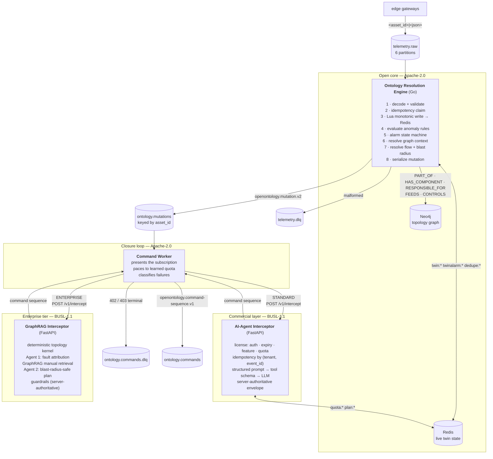

# Architecture

OpenOntology turns a stream of raw industrial telemetry into an actionable
maintenance command sequence, and draws a commercial boundary across the middle
of that path.

The shape of the system follows from one decision: **the expensive, licensed,
model-driven work must never sit on the ingestion hot path.** Telemetry arrives
continuously and cannot be paused; inference is slow, costly and occasionally
unavailable. So ingestion and planning are separate services joined by a Kafka
topic, and the boundary between free and paid falls on that same seam.

## The path a reading takes

## Why each boundary is where it is

**Ingestion is separated from planning by a topic, not a function call.** If the
engine called the planner inline, an interceptor outage or a slow inference
would apply backpressure all the way to the gateways. With a topic between them,
the engine keeps consuming at full rate and the worker's lag grows instead —
which is a metric you can alarm on rather than an outage you discover from
missing data.

**The graph sits on the hot path, but bounded three ways.** Enrichment needs the
asset's neighbourhood, so a traversal happens per mutation. A TTL cache fronts
it so a re-alerting asset re-traverses nothing; `GRAPH_QUERY_BUDGET` is enforced
both as the driver's transaction timeout and at the adapter's call boundary
(where it also covers connection acquisition and the driver's internal retries);
and config validation rejects a budget larger than `ENGINE_OP_TIMEOUT`, which
would silently remove the bound. A resolution that fails emits `degraded: true`
with the reason rather than dropping the alarm.

**Correctness state lives in Redis, not in a process.** The alarm state machine
is per-process and sharded, because it is a performance structure. The
idempotency record and the licence quota are not: they are correctness state,
and holding them per-process is silently wrong the moment a service runs more
than one replica. Both are Lua-scripted so the decision is atomic across
replicas, and both use Redis's own clock so host skew cannot widen a window.

**The two idempotency layers disagree on failure policy, deliberately.**

| Layer | Policy | Why |
|---|---|---|
| Engine ingestion (`idempotency_filter.go`) | fail **open** | Dropping telemetry loses data no retry recovers. A duplicate is already absorbed twice over: the cache write is monotonic and the state machine suppresses a repeated transition. |
| Interceptor planning (`idempotency.py`) | fail **closed** | Refusing loses nothing — the caller is a Kafka consumer with an uncommitted offset, so it redelivers. A duplicate that gets through buys a second inference and issues a second `ISOLATE` against a live asset. |

**The licence check happens before any billable work.** Four checks — key
recognised, subscription current, tier entitled, within quota — run in
middleware ahead of the route, so an unentitled request never reaches the
planner and never costs an inference.

## Components

| Component | Language | Licence | Responsibility |
|---|---|---|---|
| `services/resolution-engine` | Go | Apache-2.0 | Ingest, validate, cache, evaluate, enrich, emit |
| `services/resolution-engine/internal/graph` | Go | Apache-2.0 | Pooled Neo4j resolver; containment and flow projections |
| `services/resolution-engine/internal/crdt` | Go | Apache-2.0 | State-based graph CRDT: the replication core |
| `services/resolution-engine/replica.go` | Go | Apache-2.0 | Folds resolved topology into the replica; anti-entropy |
| `services/command-worker` | Python | Apache-2.0 | The closure loop; subscription presentation, pacing, failure classification |
| `services/ai-interceptor` | Python | **BUSL-1.1** | Licensing, metering, prompt construction, plan validation |
| `services/graphrag-interceptor` | Python | **BUSL-1.1** | ENTERPRISE tier: topology kernel, two-agent isolation, guardrails |
| `ops/neo4j` | Cypher | Apache-2.0 | Versioned ontology revisions |
| `services/operator-console` | Python | Apache-2.0 | Read-only live view of twin state, alarms and commands |
| `tools/` | Python | Apache-2.0 | Telemetry simulator, quota probe, schema export |

## State and keyspaces

One Redis instance, four namespaces that never collide:

| Prefix | Owner | Contents | Lifetime |
|---|---|---|---|
| `twin:<asset>:<sensor>` | engine | Latest reading, unit, observation time | `TWIN_STATE_TTL` (24h) |
| `twinindex:<asset>` | engine | Sensor set, so snapshots avoid `SCAN` | `TWIN_STATE_TTL` |
| `twinalarm:<asset>:<sensor>` | engine | Current alarm state | `TWIN_STATE_TTL` |
| `dedupe:<scope>` | engine | Ingestion idempotency claim | `IDEMPOTENCY_TTL` (5s) |
| `quota:<key_id>` | interceptor | Sliding-window sorted set | window length |
| `plan:v1:<tenant>:<event_id>` | interceptor | Stored plan for replay | `OO_IDEMPOTENCY_TTL_SECONDS` (24h) |

Every key carries a TTL, which is what makes `volatile-lru` safe: there is no
key the eviction policy could choose that was not already going to expire.

## Delivery guarantees

At-least-once, end to end. Offsets commit after processing, so a worker that
dies mid-message sees that message again. Every write downstream of that is
idempotent — the cache write is monotonic, the state machine suppresses repeated
transitions, and plans are stored `SET NX` per `(tenant, event_id)`.

Ordering is per-asset, not global. Mutations are keyed by `asset_id`, so one
asset's transitions stay ordered on one partition; two assets have no ordering
relationship and do not need one.

## Topology replication

Each engine holds a local CRDT replica of the asset graph — a state-based
Observed-Removed Set over vertices and edges, with per-replica Lamport
timelines. Every ontology context the engine resolves is folded into it, so the
topology a site has actually seen becomes replicated state rather than a lookup
that evaporates.

**The property it buys is a write path with no coordination.** An edge site — an
aircraft between uplinks, an isolated plant network — keeps resolving and
mutating its slice of the topology through an outage of any length, and folds
those mutations back afterwards without ever taking a distributed lock. The join
is commutative, associative and idempotent, so sites converge regardless of the
order snapshots arrive in, or whether some never do.

**Writes are content-addressed, and that is load-bearing.** `AddVertex`
re-asserts the whole property map under a fresh Lamport stamp, so folding an
unchanged context on every telemetry event would climb the clock forever, make
every snapshot differ, and turn anti-entropy into a permanent full transfer of a
graph that never changed. Nothing is written unless the content differs.

**Anti-entropy is a pull.** A replica asks its peers for state and joins it
locally, so nothing can write into a replica except through a join it initiated
or an explicit `POST /v1/replica/merge`, and an unreachable peer costs one failed
request rather than a queue of undeliverable pushes.

**Observation never fails a mutation.** Folding a context into the replica
returns nothing. A replication problem must not dead-letter an alarm: the
mutation is the product, the replica is bookkeeping that catches up on the next
observation.

The mutation payload carries `origin_replica`, `lamport_clock`, `graph_revision`
and the per-replica timelines for the asset's vertex. Two mutations for one asset
carrying different `graph_revision` values were planned against different
topologies — which is what a consumer needs to know before acting irreversibly.

`make replica-split`, `make replica-heal` and `make replica` demonstrate it end
to end; convergence is observable as the two sites reporting one digest.

## The enterprise tier

`services/graphrag-interceptor` answers the question that precedes "what should
be done": **which physical node is actually at fault.** A deterministic kernel
walks the flow topology and resolves OR-Set presence from the replica timelines,
then two agents run over its output — one attributing the fault to a localised
component or an inherited cascade, one planning a blast-radius-safe sequence
over maintenance chunks retrieved under that verdict.

Two properties are load-bearing:

**The deterministic kernel runs first, always.** Its node set is the allowlist
the agents' answers are checked against. A model may reinterpret the topology; it
may not invent one.

**Irreversible actions require a trusted graph.** Where the CRDT state for the
asset is contested — replicas disagreeing about whether the vertex is even live
— the guardrail layer downgrades an emergency shutdown to a reversible throttle
and injects a reconciliation step. That check runs *after* the planner, so
neither a model error nor a prompt injection can route around it.

It speaks the same contract as the standard interceptor, so the closure loop
routes by tier with a URL swap rather than a second code path. See
[OPEN-CORE.md](OPEN-CORE.md) for where that routing is enforced.

## Observability

Prometheus scrapes all three services plus `kafka-exporter`; Grafana ships a
provisioned dashboard. Two choices in there are worth explaining.

**The interceptor's counters are aggregated across its four uvicorn workers.**
A scrape reaches exactly one worker, so an in-process registry would report a
quarter of the traffic, varying by which worker answered — the same bug the
quota and idempotency stores exist to prevent, in a different disguise.
`prometheus_client`'s multiprocess mode fixes it, and `/readyz` reports whether
aggregation is actually engaged, because getting it wrong under-reports rather
than failing.

**`kafka-exporter` is there for the numbers no service can report about
itself.** Dead-letter depth taken from a service counter is only what that
process routed since it last restarted; taken from broker offsets it is what is
actually sitting on the topic. Consumer lag is the metric that makes the
topic-between-services decision legible: when the interceptor slows, lag on
`ontology.mutations` grows while ingestion continues at full rate.

**The operator console is an observer, not a participant.** It joins no consumer
group and commits no offsets, so it is invisible to the broker's group
coordinator and cannot distort the consumer-lag metric above. It never writes a
Redis key and holds no licence. That is what makes it safe to point at a live
system.

Labels are kept low-cardinality on purpose. `asset_id` is not a label anywhere
— a fleet has unbounded assets, and one series each is how a Prometheus
instance falls over. Per-asset detail belongs in the operator console, which
reads live state directly.

## Known limits

Stated in `README.md` under *Production notes* rather than repeated here. The
one worth knowing before reading the code: two replicas handed the same mutation
inside the planner's own latency will both miss the idempotency read and both
plan. `SET NX` makes them agree afterwards on which plan every later replay
returns, but the second inference has been paid for. Closing it properly needs a
claim taken at read time and released on failure — the shape
`idempotency_filter.go` already uses for ingestion.

## See also

- [QUICKSTART.md](QUICKSTART.md) — running it from a cold clone
- [SCHEMAS.md](SCHEMAS.md) — the payload contracts
- [OPEN-CORE.md](OPEN-CORE.md) — what is free, what is not, and where that is enforced
